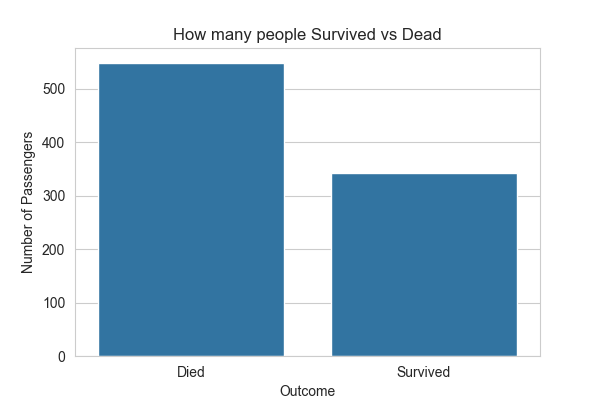
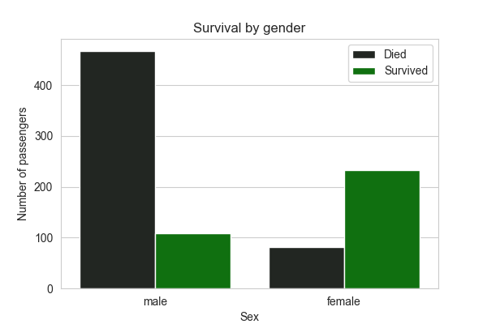
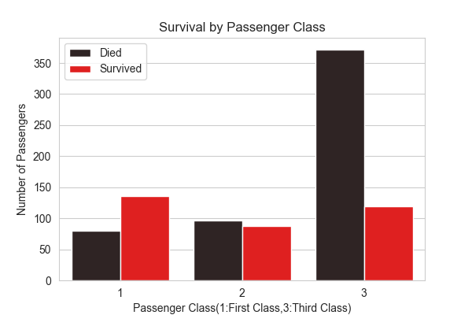
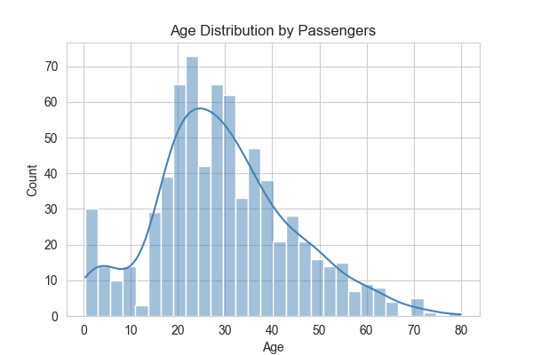
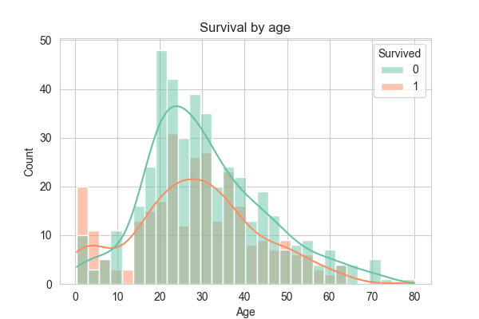
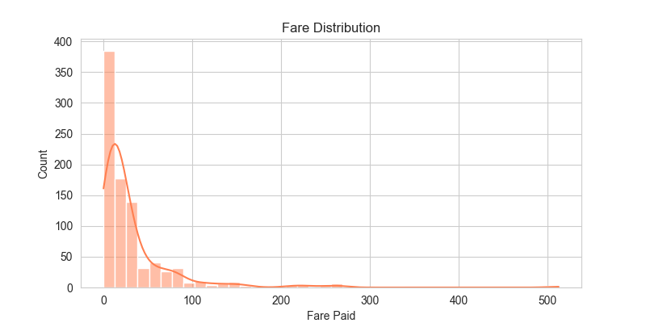
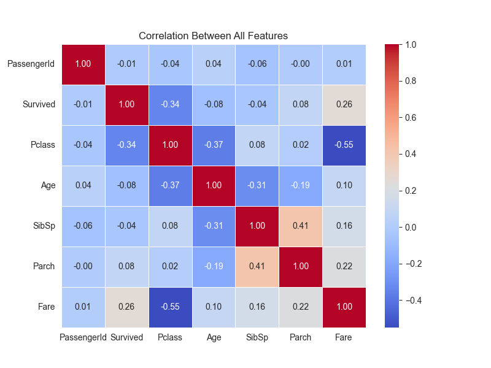
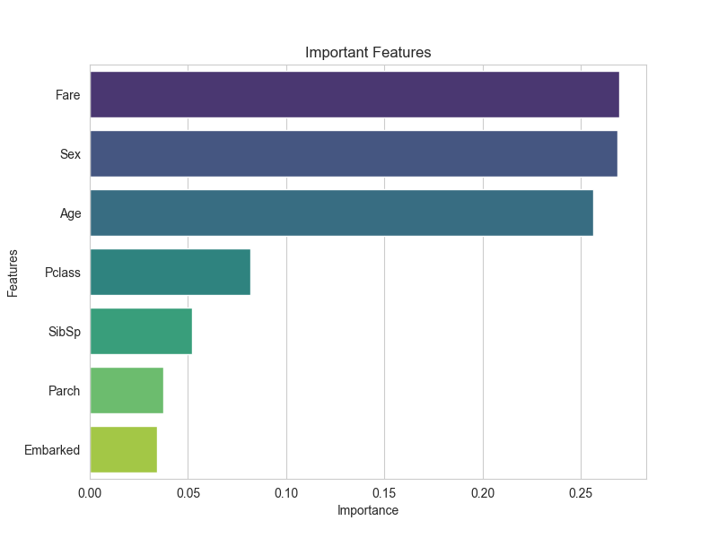

# 🚢 Titanic Survival Prediction

> Predicting who survived the Titanic disaster using
> Machine Learning — Random Forest Classifier

---

## 📌 Project Overview

The RMS Titanic sank on April 15, 1912 after hitting an iceberg.
1,502 out of 2,224 passengers died. This project analyzes
what factors determined survival and builds an ML model
to predict survival with **82.68% accuracy.**

---

## 🎯 Problem Statement

Can we predict whether a passenger survived the Titanic
based on features like age, gender, fare and class?

---

## 📊 Dataset

| Property | Value |
|---|---|
| Source | Kaggle Titanic Dataset |
| Rows | 891 passengers |
| Columns | 12 original → 8 after cleaning |
| Target | Survived (0=Died, 1=Survived) |

---

## 🔍 Key Findings from EDA

### 1. Gender was the strongest factor
- Only **18.8% of males** survived
- **74.2% of females** survived
- "Women and children first" policy was real

### 2. Wealth determined survival
- Average fare of survivors → **48.40**
- Average fare of those who died → **22.12**
- Wealthy passengers had cabins closer to lifeboats

### 3. Passenger class mattered
- 1st class survival rate → **62.9%**
- 2nd class survival rate → **47.3%**
- 3rd class survival rate → **only 24.2%**

### 4. Age played a role
- Children under 10 had higher survival rate
- Middle aged men had lowest survival rate

---

## 📈 Visualizations

### Survival Count

### Survival by Gender

### Survival by Passenger Class

### Age Distribution

### Age vs Survival

### Fare Distribution

### Correlation Heatmap

### Feature Importance

---

## ⚙️ Feature Importance

| Rank | Feature | Importance | Meaning |
|---|---|---|---|
| 1 | Fare | 26.97% | Ticket price = deck location |
| 2 | Sex | 26.84% | Gender based evacuation |
| 3 | Age | 25.64% | Children prioritized |
| 4 | Pclass | 8.18% | Ticket class |
| 5 | SibSp | 5.20% | Siblings/spouse count |
| 6 | Parch | 3.73% | Parents/children count |
| 7 | Embarked | 3.40% | Boarding port |

---

## 🧹 Data Cleaning Steps

- Dropped irrelevant columns — PassengerId, Name, Ticket, Cabin
- Filled Age missing values with median (28.0)
- Filled Embarked missing values with mode (S)
- Encoded Sex — male=0, female=1
- Encoded Embarked — S=0, C=1, Q=2

---

## 🤖 Model Details

- Algorithm — Random Forest Classifier
- Trees — 100 estimators
- Train/Test Split — 80% / 20%
- Random State — 42
- **Accuracy — 82.68%**

---

## 📉 Model Performance

| Class | Precision | Recall | F1-Score |
|---|---|---|---|
| Died | 0.84 | 0.88 | 0.86 |
| Survived | 0.80 | 0.74 | 0.77 |
| **Overall** | | | **0.83** |

---

## 🛠️ Tech Stack

| Tool | Purpose |
|---|---|
| Python | Core language |
| Pandas | Data manipulation |
| NumPy | Numerical operations |
| Matplotlib | Base visualizations |
| Seaborn | Statistical plots |
| Scikit-learn | ML model |

---

## 🚀 How to Run

1. Clone the repository

        git clone https://github.com/phanimanjunath/titanic-survival-prediction.git

2. Install dependencies

        pip install -r requirements.txt

3. Open the notebook

        cd notebooks
        jupyter notebook analysis.ipynb

4. Run all cells — Kernel → Restart and Run All

---

## 📁 Project Structure

    titanic-survival-prediction/
    │
    ├── data/
    │   └── titanic.csv
    │
    ├── notebooks/
    │   └── analysis.ipynb
    │
    ├── images/
    │   └── (all plots)
    │
    ├── requirements.txt
    └── README.md

---

## 💡 Conclusions

> Survival on the Titanic was not random.
> It was heavily determined by **gender, wealth and age.**
> Wealthy women in 1st class had the highest survival chances.
> Poor young men in 3rd class had the lowest survival chances.
> The Random Forest model learned these patterns with 82.68% accuracy.

---

## 👨‍💻 Author

**Phani Manjunath**
- GitHub: [@phanimanjunath](https://github.com/phanimanjunath)

---

⭐ If you found this project helpful, give it a star!
